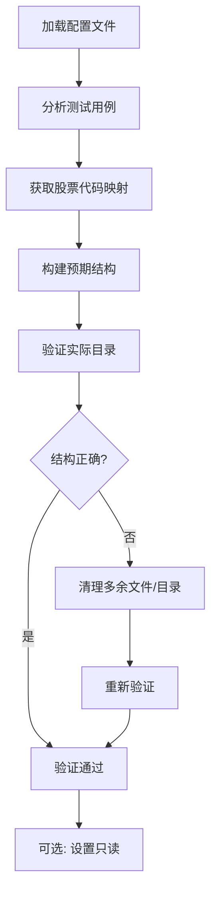

# 保护expected_results目录指南

## 问题背景

端到端测试依赖 `end2end_test/expected_results` 目录中的预期结果文件来验证下载器的正确性。然而，该目录容易被其他测试程序或开发操作"污染"，导致：

1. 测试失败（目录中出现多余文件）
2. 测试结果不一致
3. 需要手动清理目录

## 解决方案

提供了多层次的保护方案：

### 1. 自动化保护脚本 (`tools/protect_expected_results.py`)

这是一个配置驱动的Python脚本，基于 `config_e2e_official.json` 自动验证和维护目录结构。

#### 核心特性：
- **无硬编码**：所有数据来自配置文件
- **配置驱动**：使用项目的映射系统（MappingManager）
- **智能验证**：基于配置文件中的股票代码和关键词验证文件
- **安全清理**：只删除不符合预期的文件和目录

#### 使用方法：

```bash
# 预览将要进行的操作（不实际执行）
python tools/protect_expected_results.py --dry-run

# 实际验证和清理目录
python tools/protect_expected_results.py

# 验证并设置目录只读权限（如果平台支持）
python tools/protect_expected_results.py --lock

# 指定配置文件（默认为config_e2e_official.json）
python tools/protect_expected_results.py --config config_e2e_official.json
```

#### 验证逻辑：
1. 加载配置文件，获取测试用例
2. 使用MappingManager将股票代码映射为公司名称
3. 验证每个公司目录是否存在
4. 验证每个文件是否匹配配置中的关键词
5. 删除多余的文件和目录

### 2. Windows批处理脚本 (`tools/run_protection.bat`)

简化的Windows批处理文件，处理编码问题并提示用户。

```batch
# 运行保护检查
tools\run_protection.bat
```

### 3. 长效保护机制

#### 方案A：Git Pre-commit钩子（推荐）
在提交代码前自动验证目录结构：

```bash
# 创建或编辑 .git/hooks/pre-commit
#!/bin/bash
python tools/protect_expected_results.py --dry-run
if [ $? -ne 0 ]; then
    echo "错误：expected_results目录不符合配置要求"
    echo "运行以下命令修复："
    echo "  python tools/protect_expected_results.py"
    exit 1
fi
```

**当前状态**：pre-commit钩子已安装并启用。每次提交代码时都会自动检查`expected_results`目录的完整性。

#### 方案B：Windows任务计划程序
定期自动运行保护脚本：

1. 打开"任务计划程序"
2. 创建基本任务
3. 设置触发器（如：每天、每周或登录时）
4. 操作：启动程序 `python.exe`
5. 参数：`tools/protect_expected_results.py --lock`
6. 起始于：项目根目录路径

#### 方案C：CI/CD集成
在持续集成流程中添加验证步骤：

```yaml
# GitHub Actions示例
jobs:
  validate-expected-results:
    runs-on: windows-latest
    steps:
      - uses: actions/checkout@v3
      - name: 设置Python
        uses: actions/setup-python@v4
        with:
          python-version: '3.13'
      - name: 安装依赖
        run: pip install -r requirements.txt
      - name: 验证expected_results目录
        run: python tools/protect_expected_results.py
```

#### 方案D：集成到端到端测试（已实现）
端到端测试 (`tests/e2e/official_e2e_test.py`) 现在包含内置的目录检查功能：

**自动检测和恢复**：
- 每次运行端到端测试时，自动检查 `expected_results` 目录
- 检测多余的文件和目录
- 自动清理不符合预期的内容
- 输出详细的检测日志

**实现原理**：
1. 测试开始时调用 `check_and_restore_expected_results()` 函数
2. 基于 `config_e2e_official.json` 验证目录结构
3. 使用本地股票代码映射（避免外部依赖）
4. 根据关键词匹配验证文件

**优势**：
- ✅ **零配置**：无需额外设置
- ✅ **自动恢复**：测试开始时自动修复目录
- ✅ **即时反馈**：输出详细的检测信息
- ✅ **不影响测试**：清理后继续正常测试流程

**日志示例**：
```
[12:14:02] Checking expected_results directory integrity...
[12:14:02] Expected companies: ['中密控股', '珂玛科技']
[12:14:02] Found 1 extra directories:
[12:14:02]   - 测试目录
[12:14:02] Found 1 extra files:
[12:14:02]   - 中密控股\测试文件.pdf
[12:14:02] Restoring expected_results directory to clean state...
[12:14:02]   Removed extra directory: 测试目录
[12:14:02]   Removed extra file: 中密控股\测试文件.pdf
[12:14:02] Expected_results directory restored successfully.
```

## 配置说明

### 依赖关系

保护脚本依赖于以下配置文件和模块：

1. **`config_e2e_official.json`** - 端到端测试配置文件
   - `expected_result_dir`：预期结果目录路径
   - `test_cases`：测试用例列表，包含：
     - `stock_code`：股票代码
     - `allowed_keywords`：允许的文件关键词

2. **股票代码映射** - 将股票代码映射为公司名称
   - 优先使用 `MappingManager` 模块
   - 备选：直接读取 `stock_orgid_mapping.json`

### 当前预期结构

根据 `config_e2e_official.json`，预期的目录结构为：

```
end2end_test/expected_results/
├── 珂玛科技/
│   └── 珂玛科技：301611珂玛科技投资者关系管理信息20250725.pdf
└── 中密控股/
    ├── 中密控股：2025年一季度报告.pdf
    └── 中密控股：2023年1月31日投资者关系活动记录表.pdf
```

**注意**：目录名称来自股票代码映射（301611→珂玛科技，300470→中密控股）

## 故障排除

### 常见问题

1. **编码问题**（Windows命令行显示乱码）：
   ```batch
   # 使用批处理文件
   tools\run_protection.bat

   # 或手动设置编码
   chcp 65001
   set PYTHONIOENCODING=utf-8
   python tools/protect_expected_results.py
   ```

2. **导入错误**（找不到MappingManager）：
   - 确保在项目根目录运行脚本
   - 检查Python路径：`sys.path.insert(0, str(Path.cwd()))`

3. **权限问题**（无法设置只读）：
   - Windows的只读权限限制可能不严格
   - 考虑使用文件系统审计或其他安全措施

4. **映射缺失**（找不到公司名称）：
   - 检查 `stock_orgid_mapping.json` 文件
   - 运行股票代码验证工具更新映射

### 错误信息解释

- `[ERROR] 目录验证失败`：目录结构不符合预期
- `[WARNING] 目录锁定失败或部分失败`：无法设置只读权限（可能是不支持的平台）
- `找不到股票代码 XXXX 的映射`：需要更新股票代码映射

## 最佳实践

1. **定期运行**：建议在以下时机运行保护脚本：
   - 测试运行前
   - 代码提交前
   - 定期维护时（如每周）

2. **版本控制**：
   - 将干净的expected_results目录提交到版本控制
   - 使用保护脚本确保提交的目录是干净的

3. **团队协作**：
   - 在团队文档中记录保护流程
   - 在CI/CD中强制执行目录验证
   - 新成员入职时说明目录保护重要性

4. **监控和警报**：
   - 记录保护脚本的运行日志
   - 设置目录变更警报（如果支持）

## 技术实现细节

### 保护脚本工作流程



### 文件匹配逻辑

脚本使用简单的字符串包含匹配：
- 配置中的关键词：`["投资者关系管理信息20250725"]`
- 文件名称：`珂玛科技：301611珂玛科技投资者关系管理信息20250725.pdf`
- 匹配结果：✅ 文件名称包含关键词

### 扩展性考虑

1. **可配置的匹配策略**：当前使用简单包含匹配，可扩展为正则表达式
2. **多种锁定机制**：除文件权限外，可考虑使用`.lock`文件标记
3. **审计日志**：记录所有目录变更操作
4. **通知机制**：集成邮件/消息通知

## 附录

### 相关文件

- `tools/protect_expected_results.py` - 主保护脚本
- `tools/run_protection.bat` - Windows批处理包装
- `config_e2e_official.json` - 端到端测试配置
- `configs/stock_orgid_mapping.json` - 股票代码映射
- `src/data/mapping.py` - 映射管理器

### 命令行示例

```bash
# 完整的工作流程示例
cd <PROJECT_ROOT>

# 1. 预览目录状态
python tools/protect_expected_results.py --dry-run

# 2. 实际清理目录
python tools/protect_expected_results.py

# 3. 锁定目录（防止意外修改）
python tools/protect_expected_results.py --lock

# 4. 验证清理结果
python tools/protect_expected_results.py --dry-run
```

### 计划任务配置示例

1. 任务名称：`StockInfoDownloader - 保护ExpectedResults`
2. 触发器：每天 08:00
3. 操作：`python.exe`
4. 参数：`"<PROJECT_ROOT>\tools\protect_expected_results.py" --lock`
5. 起始于：`<PROJECT_ROOT>`

---

**最后更新**：2026-01-25
**维护者**：Claude Code Agent
**文档版本**：1.0